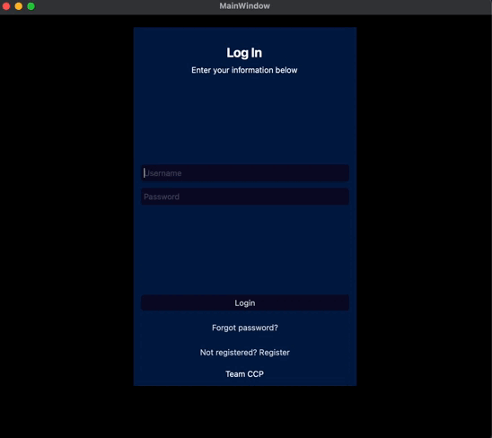

# PyQt6 User Authentication

### A simple user authentication application built using PyQt6. This project demonstrates the implementation of user registration, login, password reset via email, and secure storage of user credentials using SQLite.

## Features
- User registration with password confirmation
- User login with proper authentication
- Secure storage of user credentials using SQLite database
- Forgot password functionality with password reset token sent via email
- Smooth page transitions using fade-in and fade-out animations

## Requirements
- Python 3.6 or higher
- PyQt6
- SQLite (included in Python standard library)

## Installation
- Clone the repository:
git clone https://github.com/yourusername/PyQt6-User-Authentication.git

- Install PyQt6:
pip install PyQt6

- (Optional) Install any additional dependencies for the email functionality if needed, for example:
pip install secure-smtplib

## Usage
1. Run the application:
python main.py
2. Register a new user or log in with an existing user.
3. Use the "Forgot Password" feature to reset your password via email.

